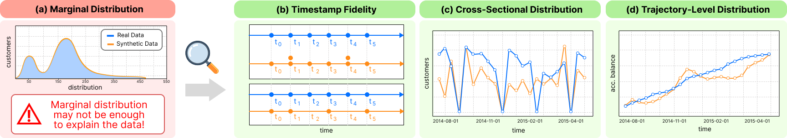
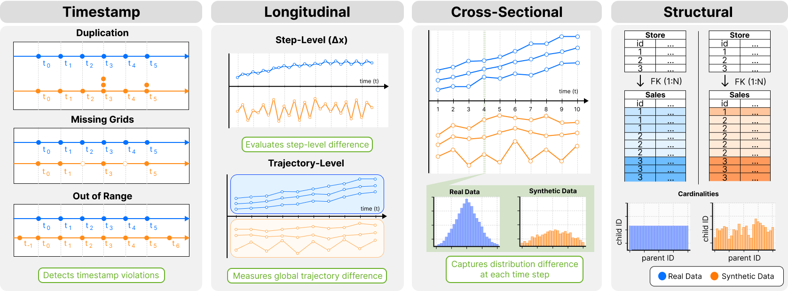
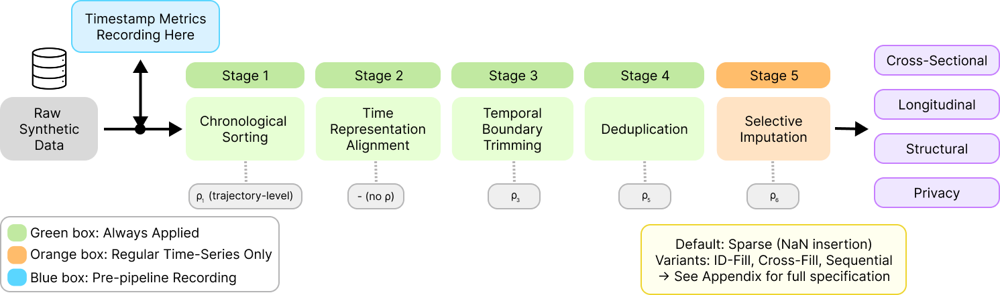

# Seq2Synth


<p align="center">
  
</p>

Seq2Synth is a benchmark evaluation framework for assessing the quality of **sequential and temporal synthetic tabular data**. It provides a unified CLI that orchestrates six categories of metrics across multiple real-world datasets and generative models.

---
## Metrics
<p align="center">
  
</p>

### Structural (`--metrics structural`)

Evaluates relational structure between parent and child tables.

| Metric | Description |
|---|---|
| `SequenceLengthSimilarity` | Compares distribution of sequence lengths per entity |
| `TemporalCardinalityShapeSimilarity` | Compares cardinality shapes over time |
| `DynamicKHopCorrelationSimilarity` | K-hop neighborhood correlation similarity |

### Timestamp Fidelity (`--metrics timestamp`)

Evaluates how faithfully synthetic data reproduces temporal patterns (periodicity, inter-arrival times, absolute/relative time representations). Supports both single-table and multi-table datasets with automatic metadata inference.

| Metric | Description |
|---|---|
| `TemporalOrderConsistency` | Checks whether each entity's timestamps are monotonically ordered |
| `TimestampUniqueness` | Measures absence of duplicate consecutive timestamps |
| `TrajectoryDurationSimilarity` | Compares per-entity trajectory duration distributions |
| `TemporalRangeCompliance` | Measures whether synthetic timestamps stay within the real temporal range |
| `RegularityConsistency` | Measures consistency with the representative interval for regular series |
| `GridCompleteness` | Measures coverage of expected regular-grid points |
| `TimeIntervalDistributionSim` | Compares inter-arrival time distributions for irregular series |

### Cross-Sectional (`--metrics cross_sectional`, `cs`)

Column-level distribution fidelity evaluated at each time step using KS tests and other statistics. Handles numerical, categorical, and datetime columns.

| Metric | Description |
|---|---|
| `CS-KSComplement` | Compares numeric distributions at each timestamp using KS complement |
| `CS-TVComplement` | Compares categorical distributions at each timestamp using TV complement |
| `CS-StatisticSimilarity` | Compares timestamp-level numeric summary statistics |
| `CS-CorrelationSim` | Compares timestamp-level numeric pairwise correlations |
| `CS-RangeCoverage` | Measures whether synthetic numeric values stay within real ranges |
| `CS-CategoryCoverage` | Measures coverage of real categories at each timestamp |
| `CS-ContingencySim` | Compares timestamp-level categorical pair co-occurrence distributions |

### Longitudinal (`--metrics longitudinal`, `long`)

Time-series quality metrics that capture temporal dynamics within each entity's sequence.

| Metric | Description |
|---|---|
| `FirstDifferenceKSComplement` | Compares first-difference distributions for numeric features |
| `TransitionMatrixTVDComplement` | Compares categorical transition matrices over time |
| `AutoCorrelationSimilarity` | Compares autocorrelation structure for numeric features |
| `TTWassersteinDistance` | Computes multivariate spectral Wasserstein distance over trajectories |

### Privacy (`--metrics privacy`)

Privacy risk metrics computed in the temporal domain:

| Metric | Description |
|---|---|
| `DCR` | General distance to closest synthetic record |
| `NNDR` | General nearest-neighbor distance ratio |
| `CS-DCR` | Timestamp-constrained distance to closest synthetic record |
| `CS-NNDR` | Timestamp-constrained nearest-neighbor distance ratio |
| `ngram_exposure` | Measures exposure of real consecutive-row patterns in synthetic trajectories |

### SDMetrics (`--metrics sd`)

Wraps [SDMetrics](https://docs.sdv.dev/sdmetrics/) for standard single-table and relational fidelity scores.

---

## Table of Contents

- [Installation](#installation)
- [Data Layout](#data-layout)
- [Quick Start](#quick-start)
- [Temporal Post-Processing](#temporal-post-processing)
- [Supported Datasets](#supported-datasets)
- [Results](#results)

----

## Installation
```bash
conda env create -f environment.yml
```
or
```bash
pip install -r requirements.txt
```

Python 3.10+ is recommended. Key dependencies include `pandas`, `numpy`, `scipy`, `scikit-learn`, `sdmetrics`, and `POT` (for Wasserstein distance).

---

## Data Layout

Place data under `data/` following this structure:

```
data/
├── real/
│   └── <dataset>/           # e.g., cmapss/, hnm/, fanniemae/
│       ├── <table>.csv
│       └── metadata.json    # SDV-style metadata
└── synthetic/
    └── <dataset>/
        └── <model>/         # e.g., CLAVADDPM/, SDV/
            └── <table>.csv
```

Post-processed variants are written as siblings of the raw synthetic file:

| Variant | Filename suffix |
|---|---|
| `raw` | *(none)* |
| `default` | `_postprocessed` |
| `id_fill` | `_postprocessed_id_fill` |
| `prev_fill` | `_postprocessed_prev_fill` |
| `interp_fill` | `_postprocessed_interp_fill` |

---


## Temporal Post-Processing

The post-processing pipeline (`seq2synth/processing/temporal_postprocessing.py`) corrects temporal artifacts in raw synthetic outputs before evaluation. It is **dataset-aware** and driven by presets defined in the script.

**Pipeline overview:**

<p align="center">
  
</p>


### 4-Stage Pipeline

```
Stage 1 → Sort
Stage 2 → Temporal value handling
Stage 3 → Deduplication
Stage 4 → Grid imputation (regular datasets only)
```

**Stage 1 — Sort**: Sorts by `(key_col, time_col)`. For sequential mode, sorts by `key_col` only. Airbnb sorts by `(key_col, row_index)` because `secs_elapsed` is a relative duration.

**Stage 2 — Temporal value handling** (method-dependent):

| Method | Behavior |
|---|---|
| `sparse` | Boundary trim to real `[min, max]`. Duration datasets clip above real max. Regular datasets snap to grid. |

**Stage 3 — Deduplication**: Full-row, `(key, time)`, or none, depending on the dataset preset.

**Stage 4 — Grid imputation** (regular datasets only): Inserts missing grid rows, then fills them with one of:

| Fill method | Description |
|---|---|
| `sparse` | No fill (grid rows left as NaN) |
| `id_fill` | Per-entity mean/mode imputation |
| `prev_fill` | Forward-fill |
| `interp_fill` | Linear interpolation (numeric) + ffill/bfill (categorical) |

### Dataset Presets

| Dataset | Key col | Time col | Periodicity | Time kind |
|---|---|---|---|---|
| airbnb_tabdit | user | secs_elapsed | Irregular | duration |
| berka_tabdit | user | Date | Irregular | date_string |
| citi_bike | bikeid | starttime | Irregular | datetime |
| cmapss | unit_nr | time_cycles | Regular | integer |
| coupon | USER_ID | I_DATE | Irregular | datetime |
| fanniemae | *(inferred)* | timestamp | Regular | datetime (monthly) |
| freddiemac | *(inferred)* | timestamp | Regular | datetime (monthly) |
| google_cluster | machine_id / job_id | time / start_time | Mixed | numeric |
| hnm | customer_id | t_dat | Irregular | datetime |
| ptbxl | ecg_id | step | Regular | integer |
| rossmann | *(inferred)* | Date | Regular | datetime (daily) |
| rossmann_tabdit | user | Date | Regular | date_string |
| walmart | Store | Date | Regular | datetime |

### Running Post-Processing

```bash
python seq2synth/processing/temporal_postprocessing.py \
    --dataset cmapss \
    --model CLAVADDPM \
    --method sparse

# With method override for a regular dataset
python seq2synth/processing/temporal_postprocessing.py \
    --dataset fanniemae \
    --model SDV \
    --method id_fill

# Multi-table dataset
python seq2synth/processing/temporal_postprocessing.py \
    --dataset coupon \
    --model CLAVADDPM \
    --method interp_fill
```

---

## Quick Start

```bash
# Run all metrics on all datasets and models
python main.py

# Run a specific metric on a specific dataset and model
python main.py \
    --metrics timestamp \
    --datasets coupon   \
    --models CLAVADDPM  \
    --variants default

# Run cross-sectional + longitudinal metrics in parallel with 4 workers
python main.py \
    --metrics cross_sectional longitudinal \
    --datasets hnm freddiemac \
    --parallel \
    --workers 4

# Dry-run: print commands without executing
python main.py --metrics all --dry-run
```

### CLI Arguments

| Argument | Default | Description |
|---|---|---|
| `--metrics` | `all` | Metrics to run. See [Metrics](#metrics) for aliases. |
| `--datasets` | `all` | Datasets to evaluate, or `all`. |
| `--models` | `all` | Model folder names to include. |
| `--variants` | *(all)* | Post-processing variant(s) to evaluate. |
| `--parallel` | `False` | Run metric internals concurrently. |
| `--workers` | auto | Worker count for `--parallel`. |
| `--dry-run` | `False` | Print commands without executing. |


---

## Supported Datasets

| Dataset | Domain | Tables | Periodicity |
|---|---|---|---|
| airbnb_tabdit | Travel bookings | 2 | Irregular |
| berka_tabdit | Banking transactions | 2 | Irregular |
| citi_bike | Bike sharing | 1 | Irregular |
| cmapss | Turbofan engine degradation | 1 | Regular |
| coupon | E-commerce coupons | 2 | Irregular |
| fanniemae | Mortgage performance | 2 | Regular (monthly) |
| freddiemac | Mortgage performance | 2 | Regular (monthly) |
| google_cluster | Cloud cluster traces | 4 | Mixed |
| hnm | Fashion retail transactions | 2 | Irregular |
| home_credit | Credit risk | 7 | Mixed |
| ptbxl | ECG signal records | 1 | Regular |
| rossmann | Retail store sales | 2 | Regular (daily) |
| rossmann_tabdit | Retail store sales | 2 | Regular |
| walmart | Retail sales | 2 | Regular (weekly) |

---

## Results

Metric outputs are written to `results/<dataset>/<model>/<metric>/`. JSON files contain per-model scores; `analysis/` contains aggregated CSVs and bar-chart PNGs across models.

```
results/
└── <dataset>/
    └── <model>/
        ├── timestamp/<model>.json
        ├── structural/<metric>.json
        ├── cross_sectional/<metric>.json
        ├── longitudinal/<metric>.json
        ├── privacy/<metric>.json
        └── sd/<metric>.json
```
